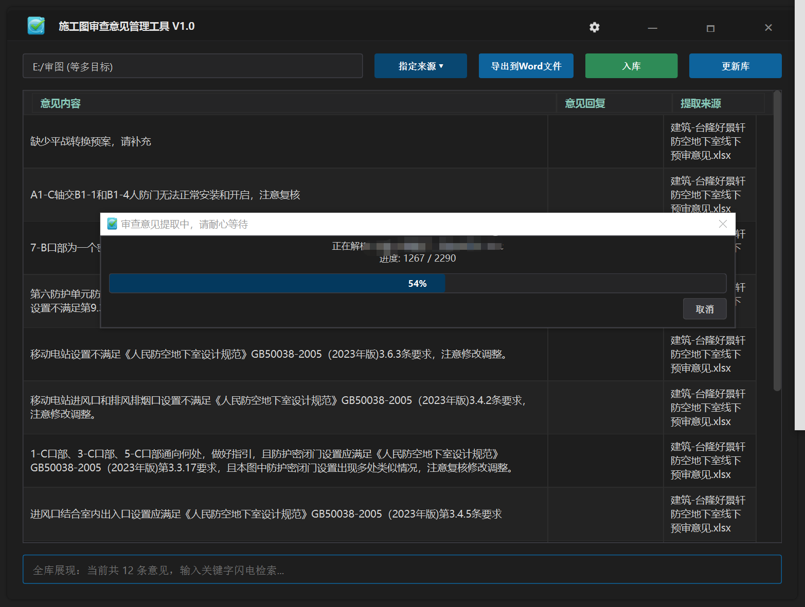
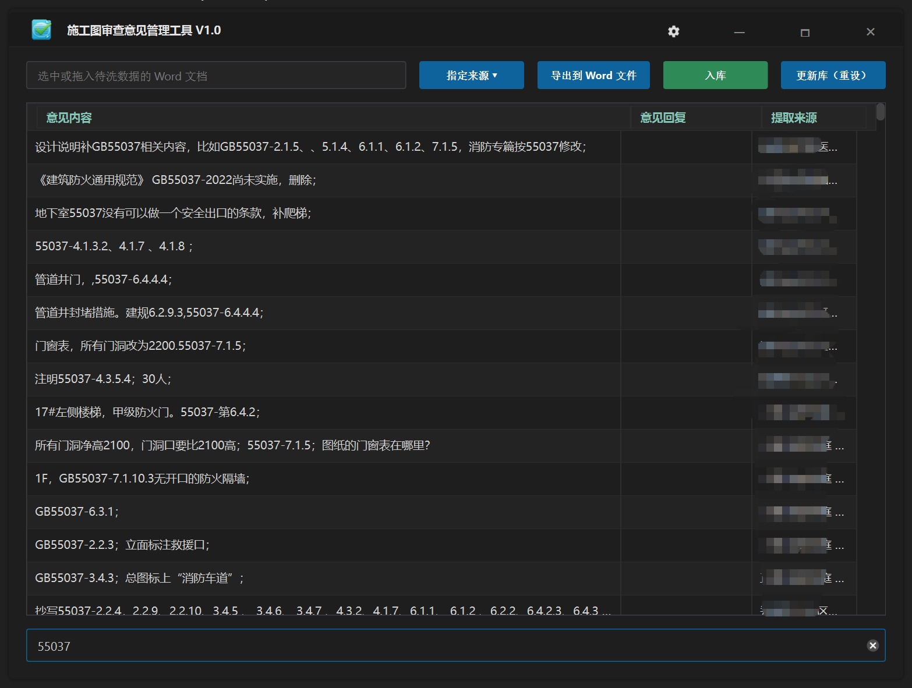

# 🚀 OpinionViewer (施工图审查意见管理工具)

---

这是一个专为处理复杂、非结构化文档（Word / Excel）设计的审查意见智能提取工具。针对海量文件（支持doc、docx、xls、xlsx、txt格式）。

### 📸 运行效果 (Preview)

  
  

## 🎯 项目背景
在日常工作中，经常需要从成百上千份格式各异的文档中提取“审查意见”。传统的解析方案在面对以下情况时极易崩溃：
- 💀 **Excel 幽灵行陷阱**：用户误操作导致 Excel 实际只有 50 行，但底层判定为 100 万行，导致常规 C++ 解析器陷入死循环。
- 🧊 **UI 阻塞与假死**：海量数据装配在主线程，导致程序直接无响应。
- 💥 **内存碎片化**：频繁的内存分配导致程序在处理大批量文件时直接 Crash。

本项目通过**多线程并发架构**和**硬核的底层熔断逻辑**，实现了“秒级”处理速度与极高的系统稳定性。

## ✨ 核心特性
- 🛡️ **防爆解析引擎**：针对 Excel 的 `UsedRange` 维度爆炸问题，内置“物理熔断”与“硬截断”机制，即使 100 万行的空表也能在 **0.1 秒**内安全跳出。
- ⚡ **极速多线程并发**：采用 `QtConcurrent` 架构，支持海量文件并发解析，充分榨干 CPU 多核性能。
- 🧹 **智能正则清洗**：内置 `rule15` 正则清洗引擎，自动剔除冗余空格与非标字符，保证入库数据的高纯度。
- 🎨 **极致交互与 UI 性能**：优化表格渲染逻辑，彻底铲除 `resizeRowsToContents` 带来的主线程性能肿瘤。配合**智能防抖 Hover 悬浮窗**与**极简暗黑风**，十万级数据依然瞬间呈现、丝滑滚动。
- 💾 **SQLite 原子落盘**：底层采用 `INSERT OR IGNORE` 逻辑，保障海量数据无缝同步入库，告别主键冲突。

## 🛠️ 技术栈
| 组件 | 详情 |
| :--- | :--- |
| **核心语言** | C++ 17 |
| **GUI 框架** | Qt 6.x |
| **文档接口** | Windows COM / OLE |
| **本地存储** | SQLite 3 |

## 📦 快速构建
1. 使用 **Visual Studio 2022** 打开 `ReviewOpinionTools.sln` 解决方案。
2. 确保已正确配置 **Qt MSVC** 编译环境。
3. 切换至 `Release` 模式，直接编译生成可执行文件即可。

## ⚖️ 许可协议 (License)
本项目采用 [MIT License](LICENSE) 开源协议。您可以自由使用、修改及商用，只需保留原作者声明即可。

---

<i>如果这个工具为你省下了处理文档的精力，不妨点亮右上角的 <b>⭐ Star</b> 支持一下！</i>

